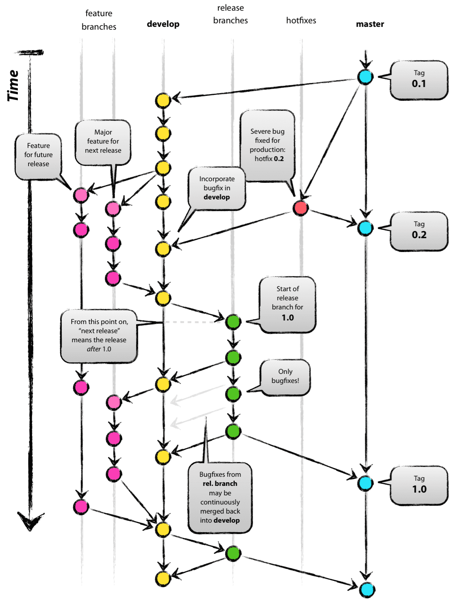

merge 테스트 - master 브랜치 수정 사항
# Git Workflow 정리

## 목차

1. [Git Workflow]
2. [Workflow 관련 Git 명령어 소개]

---

## 1. [Git Workflow]
### Git Workflow 란?
* 2010년 Vincent Driessen이 아래 Reference에 있는 A successful Git branching model이라는 글을 기고 하면서 널리 알려진 Git으로 개발하는 방법론
* 5개의 브랜치 형태를 통해 코드를 관리하는 방법론
  * master
    * 브랜치의 시작이며 고객에게 배포하기 위한 브랜치
  * develop   
    * 개발 브랜치로 master 브랜치에서 분기되며, feature 브랜치에서 개발된 코드를 merge 하거나, 기능 개발이 완료된 코드를 반영하는 브랜치
    * 모든 기능이 개발되고, QA (품질검사) 완료 후 master 브랜치에 merge 됨
  * feature
    * 단위 기능을 개발하는 브랜치로 develop 브랜치에서 분기되며, 개발 완료 후 develop 브랜치로 merge 를 진행한다. 
  * release
    * 배포 전 QA (품질검사) 를 하기위한 브랜치로 develop 브랜치에서 분기됨
    * QA 과정에서 나온 버그는 release 브랜치에서 수정 및 반영을 진행하며, QA 가 완료되면 master 브랜치와, develop 브랜치에 merge 를 진행한다.
  * hotfix
    * master 브랜치로 배포 후 버그가 발생하였을 떄 긴급하게 수정을 진행하는 브랜치
      
</img> 

## 2. [Workflow 관련 Git 명령어 소개]

* git 에서 형상 관리를 진행함에 있어 유용한 키워드들을 정리하였다.
* checkout
* tag
* merge
* stash
* fetch
* rebase
* pull
* tag

레퍼런스 
 * https://gmlwjd9405.github.io/2018/05/11/types-of-git-branch.html
